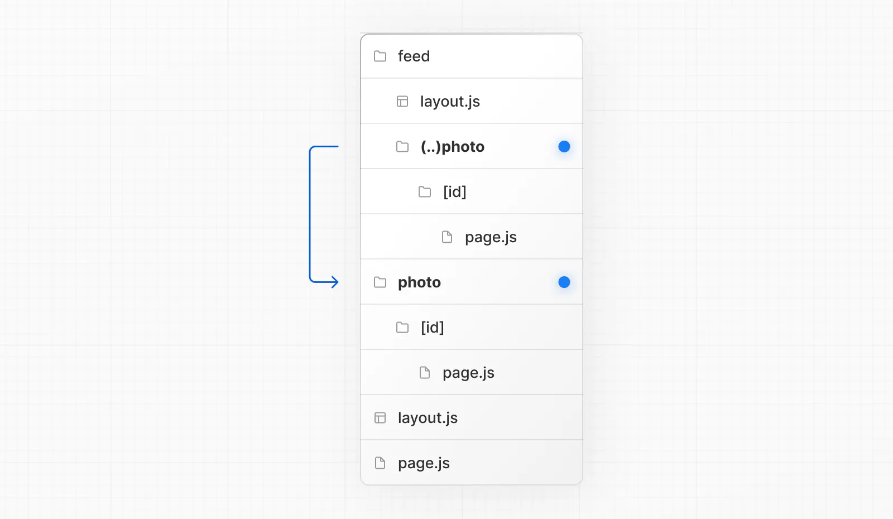

# Next ~~13~~ 14 App Router

---
1. Page
2. Navigating
3. Layout
4. Streaming to Loading
5. Error
6. Route Group
7. Dynamic Route
8. Parallel Route
9. Intercept Route

---

# What create a route?
## Page.js/tsx

---


---


---

# Navigating

---

## ``<Link>``
### Prefetch and Client side

```tsx
import Link from 'next/link'
import { usePathname } from 'next/navigation'

export default function Page() {
  const pathname = usePathname()

  return <>
  <Link href="/dashboard">Dashboard</Link>
  <Link href="/dashboard#setting">To Setting</Link>
  <Link className={`link ${pathname === '/about' ? 'active' : ''}`} href="/about">
    About
  </Link>
  </>
}
```

---

## ``useRouter``
### In client component.
> financial - app/login/_hooks/useLoginForm.ts

> In server component, you can use Redirect.

```tsx
'use client'
 
import { useRouter } from 'next/navigation'
 
export default function Page() {
  const router = useRouter();
  return (
    <button type="button" onClick={() => router.push('/dashboard')}>
      Dashboard
    </button>
  )
}
```

---

### Disable scroll restoration

```tsx
// next/link
<Link href="/dashboard" scroll={false}>
  Dashboard
</Link>
```
```tsx
// useRouter
import { useRouter } from 'next/navigation'
 
const router = useRouter()
 
router.push('/dashboard', { scroll: false })
```

---

# Layout feature:
## layout.js/tsx

---

### A layout will wrap the pages on the same and lower level.


---

### A page will be send in layout as children.
> financial - app/login/layout.tsx

```tsx
export default function DashboardLayout({
  children, // will be a page or nested layout
}: {
  children: React.ReactNode
}) {
  return (
    <section>
      {/* Include shared UI here e.g. a header or sidebar */}
      <nav></nav>
 
      {children}
    </section>
  )
}
```

---

### Root layout is required, only root will and is able to present the initial HTML structure.
> (Root layout is not a preserved word)
> financial - app/layout.tsx

```tsx
export default function RootLayout({
  children,
}: {
  children: React.ReactNode
}) {
  return (
    <html lang="en">
      <body>{children}</body>
    </html>
  )
}
```

---

## Let's nest our layouts!

---


---


# Streaming to Loading and Error
---


## Instant loading sates right after navigating.


```tsx
export default function Loading() {
  return <LoadingSkeleton />
}
```
---

### Loading page will affect the same-level page.js file and any children below in a <Suspense> boundary.


---

## Without Streaming 


---

## These steps are sequential and blocking!


> Though SSR already improve the performance showing a non-interactive page.

---

# With Streaming
> Need to be used with server side code!


---

### Break down HTML into smaller chunks and progressively send to client.


---

### Wrapping ``<Suspense>`` around components that performs asynchronous actions

```tsx
import { Suspense } from 'react'
import { PostFeed, Weather } from './Components'
 
export default function Posts() {
  return (
    <section>
      <Suspense fallback={<p>Loading feed...</p>}>
        <PostFeed /> 
      </Suspense>
      <Suspense fallback={<p>Loading weather...</p>}>
        <Weather />
      </Suspense>
    </section>
  )
}
```

---

# Error

---


Adding ``error.js/tsx`` will create an error UI.
 > financial - app/list/error.tsx

```tsx
'use client' // Error components must be Client Components
 
import { useEffect } from 'react'
 
export default function Error({
  error,
  reset,
}: {
  error: Error & { digest?: string }
  reset: () => void
}) {
  useEffect(() => {
    // Log the error to an error reporting service
    console.error(error)
  }, [error])
 
  return (
    <div>
      <h2>Something went wrong!</h2>
      <button
        onClick={
          // Attempt to recover by trying to re-render the segment
          () => reset()
        }
      >
        Try again
      </button>
    </div>
  )
}

```
---

#### Next will automatically create a React Error Boundary


---

## Recover from error

```tsx
'use client'
 
export default function Error({
  error,
  reset,
}: {
  error: Error & { digest?: string }
  reset: () => void
}) {
  return (
    <div>
      <h2>Something went wrong!</h2>
      <button onClick={() => reset()}>Try again</button>
    </div>
  )
}
```
---

## Errors will bubble up to nearest error boundary,
> but the same-level layout is outside the boundary.


---

#### ``global-error.js`` will wrap the whole site.
> Still recommend to define a root error.js.
> financial - app/global-error.tsx


```tsx
'use client'
 
export default function GlobalError({
  error,
  reset,
}: {
  error: Error & { digest?: string }
  reset: () => void
}) {
  return (
    <html>
      <body>
        <h2>Something went wrong!</h2>
        <button onClick={() => reset()}>Try again</button>
      </body>
    </html>
  )
}
```

---

# Router Group

---

### Naming the folder as ``(folderName)`` will create a group, and it will not affect the real path.


---

## Router group can utilize multiple layouts.


---

## Put specific page into a different layout.


---

## To create multiple root layouts, you should remove top-level layout.


---

# Dynamic Routes
---

## Name folders as ``[paramName]``
---
### Dynamic Segments are the params prop of ``layout``, ``page``, ``route``, and ``generateMetadata`` functions.
> financial - app/setting/promotion/edit/[promotionId]


### In TS, type of Segments can be configured.

```tsx
export default function Page({ params }: { params: { paramName: string } }) {
  return <h1>My Page</h1>
}
```
---

## Catch-all Segments

### Name folders as ``[...paramName]``


---

## Optional Catch-all Segments
### Name folders as ``[[...paramName]]``, the path without segments will also be matched!


---

# Parallel Routes

---

## Use ``@`` to create a slot folder, page insides will become a parallel page.


---

## These parallel pages will be send to the layout above the ``@folder`` as arguments.
> financial - app/layout

```tsx
export default function Layout(props: {
  children: React.ReactNode
  analytics: React.ReactNode
  team: React.ReactNode
}) {
  return (
    <>
      {props.children}
      {props.team}
      {props.analytics}
    </>
  )
}
```

---

## You can render different pages at the same time.

--- 


---

## Each page will have their independent state.
---


---

# You can conditionally render them.

---


---

## When encounter unmatched routes, you can create a default.js/tsx to fallback.

### For example, when route to /setting, @analytics will fallback to default.js.

### Also notice, ``@folder`` will not be counted as a part of URL.


---

# Intercepting routes

---

## Routes can be intercepted when navigating with NextJs Link or Router.
> financial - app/@loginModal/(.)login


### Clicking the URL or refreshing the page will not trigger intercepting.
---



## Rule is similar to the relative path convention ``../``

- (.) to match the same level
- (..) to match one level above
- (..)(..) to match two levels above
- (...) to match segments from the root app directory

---


## Modal

### Combine Intercepting Routes and Parallel Routes, you can create modals that are parts of routing.

- Shareable through a URL
- Preserve context when the page is refreshed
- Close the modal on backwards navigation
- Reopen the modal on forwards navigation
---


---

(#‵)3′)▂▂▂▃▄▅～～～嗡嗡嗡嗡嗡嗡嗡嗡嗡嗡嗡嗡嗡嗡
魔貫光殺砲(ﾟДﾟ)σ━00000000000━●
(๑•̀ㅂ•́)و✧ 
(´･д･｀)ﾊ(･д･｀*)
